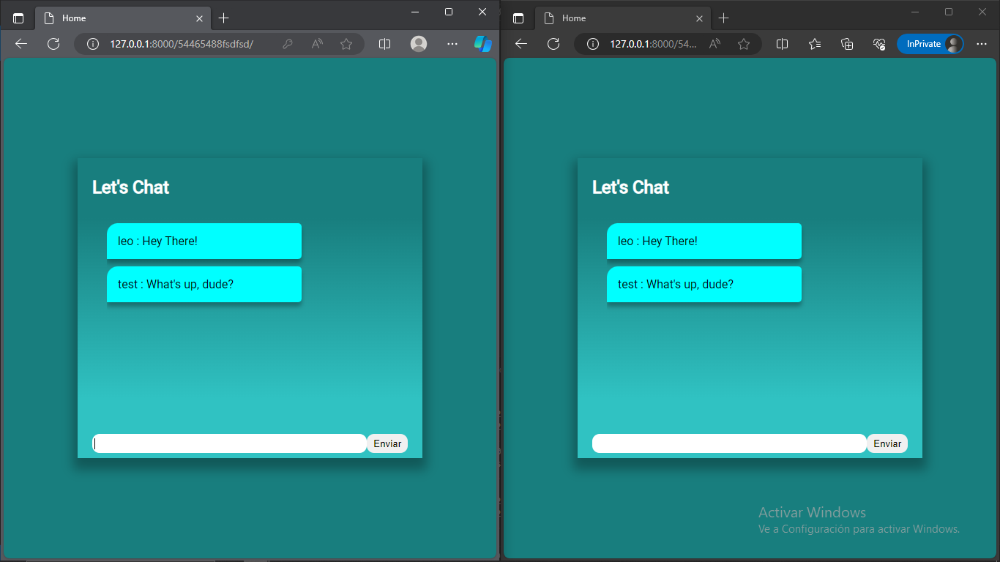

# Chat Application
After clone this repository you should type in your terminal:  
pip install -r requirements.txt

## This Project has been created for a coder tutorial on my blog

## Tools
Python - Progamming Language  
Django - Web Framework  
WebSocket - Real Time Comunication  
HTML, CSS, JavaScript  

